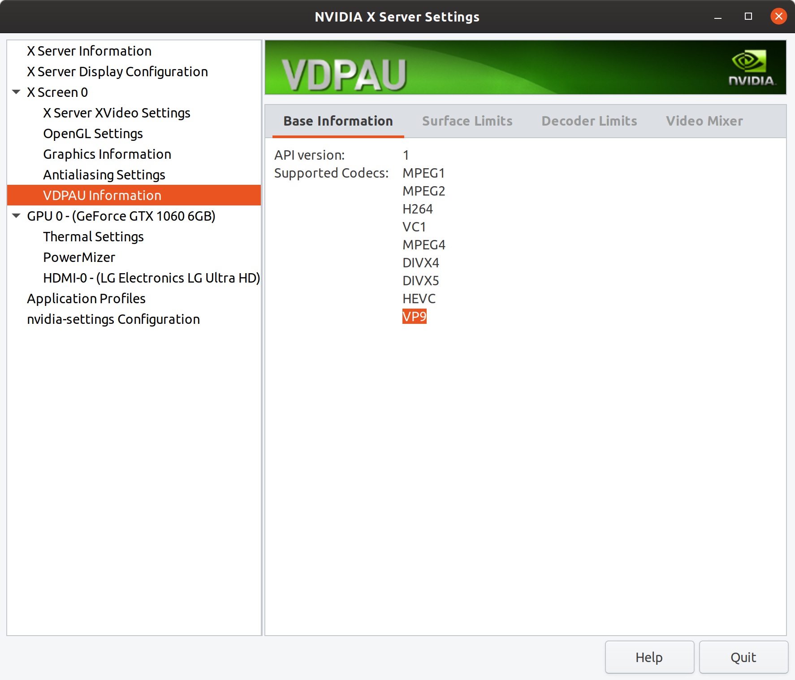

# vdpau-va-driver-vp9
Experimental VP9 codec support for vdpau-va-driver (NVIDIA VDPAU-VAAPI wrapper) and chromium-vaapi

Forked off Ubuntu vdpau-va-driver (which includes some patches over the original freedesktop code):
https://launchpad.net/~saiarcot895/+archive/ubuntu/chromium-beta/+sourcepub/10036592/+listing-archive-extra

C associative map taken from (and modified to use integer keys) [sorry, the modifications are really makeshift]:
https://github.com/rxi/map

# Notes

This adds experimental NVIDIA hardware video acceleration support to vdpau-va-driver for videos encoded using VP9 Profile 0 8-bit color depth. This seems to include most of the latest and greatest 4k and 8k videos I've used on YouTube that are hardest on the CPU, also available at lower resolutions in the same codec. As of writing, VP9 Profile 1-3 are not supported in the NVIDIA VDPAU library itself, so support for those cannot be added here either. VP8 also is not supported.

To check whether your GPU can decode VP9, please check the NVDEC support matrix. I believe that this should match the VDPAU capabilities.

https://developer.nvidia.com/video-encode-decode-gpu-support-matrix

# Requirements

I recommend following this guide. https://www.linuxuprising.com/2018/08/how-to-enable-hardware-accelerated.html
That's how I started. It includes information on everything you need, except this driver. Following the guide completely up to step 3 and then installing this driver will be enough if you're not sure what to do. If you know what you're doing, then you should skip installing vdpau-va-driver from that guide. Also, don't install h264ify if you're planning on using VP9.

1. GPU with VP9 NVDEC decode support: https://developer.nvidia.com/video-encode-decode-gpu-support-matrix
2. NVIDIA Linux video driver (only tested with 440.44 so far; not sure what the minimum version is for VP9 support)

   nvidia-settings should show "VP9" under X Screen/VDPAU Information/Base Information
   

3. Chromium with VAAPI patch (NOT Google Chrome)
4. VDPAU latest include headers (for compiling this patch): https://gitlab.freedesktop.org/ManojBonda/libvdpau

# Original author of vdpau-va-driver

https://github.com/freedesktop/vdpau-driver

  libva-vdpau-driver
  A VDPAU-based backend for VA-API

  Copyright (C) 2009-2011 Splitted-Desktop Systems

# Debugging

## vdpau-va-driver
Verbose debug messages
```
export VDPAU_VIDEO_DEBUG=1
```

More detailed trace messages that output data structures
```
export VDPAU_VIDEO_TRACE=1
```

## NVIDIA VDPAU
Trace all function calls made to VDPAU library and dump most parameters

https://download.nvidia.com/XFree86/Linux-x86_64/440.44/README/vdpausupport.html

VDPAU_TRACE: Enables tracing. Set to 1 to trace function calls. Set to 2 to trace all arguments passed to the function.
VDPAU_TRACE_FILE: Filename to write traces to. By default, traces are sent to stderr. This variable may either contain a plain filename, or a reference to an existing open file-descriptor in the format "&N" where N is the file descriptor number.

```
export VDPAU_TRACE=2
export VDPAU_NVIDIA_DEBUG=3
export VDPAU_TRACE_FILE=chromium-vdpau.log
```
